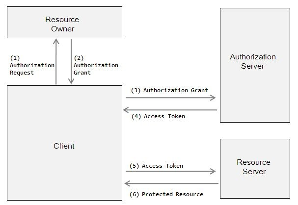
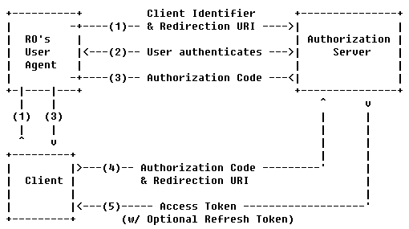
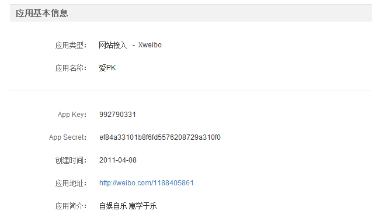
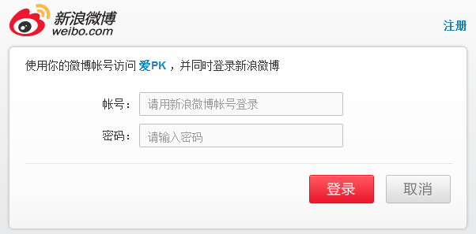
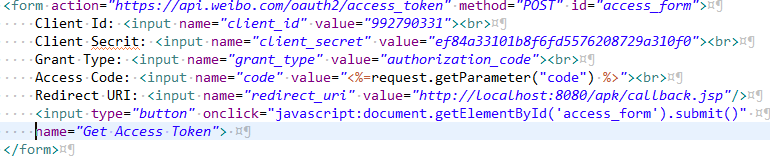
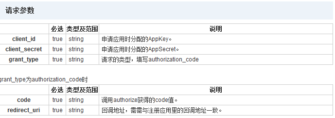

### OAuth协议介绍

当某个互联网应用发展到一定规模时用户和内容的增长就会产生瓶颈，这时单方面从本应用本身的优化和改进很难保持持续的增长速度，如果说有很多开发者或者第三方公司来帮你一起吸引更多用户加入，那么开放平台是势在必行的。你所看到的BAT(Baidu, Alibaba, Tencent)无一不在大力发展起开放平台，这正也说明此观点。此处不对开放平台做详细介绍，感兴趣的童鞋请参考文章[[互联网开放平台应用综述](http://www.williamlong.info/archives/2289.html)]。

新浪微博在开放服务后一定碰到的几个问题是：

> 用户如何管理，如何认证用户？

开放平台后后台数据的访问不在单一是新浪微博一个，而是千百个“新浪微博”；如果新浪微提供一个认证服务，其他应用通过调用认证服务来验证用户，可行吗？当然不行，这样用户数据安全无从谈起。

> 如何只让第三方应用访问用户想让它访问的内容？

新浪微博提供很多接口供第三方应用调用，如微博列表，发微博，好友圈，用户信息等，不能保证所有的第三方都是本着“不做恶”的宗旨访问新浪微博的服务，所以用户必须有权利决定第三方应用“做自己该做的事情”。

给予开放平台的用户认证安全和资源访问安全，`OAuth`适时的产生，其提供一套完整的安全方案来解决这些问题。

#### OAuth是什么

`OAuth`（开放授权）是一个开放标准，允许用户让第三方应用访问该用户在某一网站上存储的资源，而无需将用户名和密码提供给第三方应用。

`OAuth`允许用户提供一个令牌，而不是用户名和密码来访问他们存放在特定服务提供者的数据。每一个令牌授权一个特定的网站在特定的时段内访问特定的资源。这样，OAuth允许用户授权第三方网站访问他们存储在另外的服务提供者上的信息，而不需要分享他们的访问许可(帐号,密码)或他们数据的所有内容。

`OAuth 1.0`起初定义了三种流程：基于web的应用程序，桌面客户端，手机等其他设备。然而，随着规范的确立，这三种流程合并成了一种。 `OAuth 2.0`关注客户端开发者的简易性，同时为Web应用，桌面应用，Mobile应用和智能设备提供专门的统一的认证流程。

#### 协议的参与者

`OAuth`的参与实体有如下四个：

- **RO (resource owner)**: 资源所有者，对资源具有授权能力的人。一般为用户。
- **RS (resource server)**: 资源服务器，它存储资源，并处理对资源的访问请求。如Sina微博服务器，它保存用户的好友信息和微博、评论等。
- **Client**: 第三方应用，它获得RO的授权后便可以去访问RO的资源。如爱PK。
- **AS (authorization server)**: 授权服务器，它认证RO的身份，为RO提供授权审批流程，并最终颁发授权令牌(Access Token)。

注意，为了便于协议的描述，这里只是在逻辑上把AS与RS区分开来；在物理上，AS与RS的功能可以由同一个服务器来提供服务。

#### 认证和授权过程

**基本流程**



1. Client请求RO的授权，请求中一般包含：要访问的资源路径，操作类型，Client的身份等信息。
2. RO批准授权，并将“授权证据(Authorization Grant)”发送给Client。至于RO如何批准，这个是协议之外的事情。典型的做法是，AS提供授权审批界面，让RO显式批准。
3. Client向AS请求“访问令牌(Access Token)”。此时，Client需向AS提供RO的“授权证据”，以及Client自己身份的凭证。
4. AS验证通过后，向Client返回“访问令牌”。访问令牌也有多种类型，若为bearer类型，那么谁持有访问令牌，谁就能访问资源。
5. Client携带“访问令牌”访问RS上的资源。在令牌的有效期内，Client可以多次携带令牌去访问资源。
6. Rs验证令牌的有效性，比如是否伪造、是否越权、是否过期，验证通过后，才能提供服务。

#### 授权码类型的开放授权协议

**授权过程**



1. Client初始化协议的执行流程。首先通过HTTP 302来重定向RO用户代理到AS。Client在`redirect_uri`中应包含如下参数：`client_id`, `scope `(描述被访问的资源), `redirect_uri `(即Client的URI). AS将提供交互页面，要求RO必须显式地批准（或拒绝）Client的此次请求。
2. AS认证RO身份，并提供页面供RO决定是否批准或拒绝Client的此次请求。
3. 若请求被批准，AS使用步骤1中Client提供的`redirect_uri`重定向RO用户代理到Client。`redirect_uri`须包含`authorization_code`。若请求被拒绝，AS将通过`redirect_uri`返回相应的错误信息。
4. Client拿`authorization_code`去访问AS以交换所需的`access_token`。Client请求信息中应包含用于认证Client身份所需的认证数据，以及上一步请求`authorization_code`时所用的`redirect_uri`。
5. AS在收到`authorization_code`时需要验证Client的身份，并验证收到的`redirect_uri`与第3步请求`authorization_code`时所使用的`redirect_uri`相匹配。如果验证通过，AS将返回`access_token`，以及`refresh_token`（若`access_type=offline`）

### OAuth在新浪微博中的应用

**第三方应用示例**



在新浪微博开发者中心申请一个应用后会生成一个对应的`App_Key`，它们对应于前文中的app identifier。当发布此应用后用户就可以通过`OAuth`协议进行用户认证。在获得新浪微博授权之前，所有访问新浪微博内容的请求都会首先获得`Access Token`，当Client获得有效的`Access Token`之后就可以对授权的资源进行访问。

在此示例中将说明新浪微博市是如何通过用户授权的方式获取`Access Token`：

1. 请求`Authroization Code`: 访问地址`https://api.weibo.com/oauth2/authorize?client_id=992790331&scope=email,direct_messages_write&forcelogin=true&redirect_uri=http://localhost:8080/apk/callback.jsp``

   `client_id`：应用的App_Key scope: 表示应用需要访问的资源

   `forcelogin`：是否强制用户重新登录，true：是，false：否。默认false。

   `redirect_url`：授权成功后所回调的Client的URL地址

2. AS将提供交互页面，要求RO必须显式地批准（或拒绝）Client的此次请求。



3. 当用户允许Client应用爱PK访问指定的资源后，AS将会返回`Authorization Code`到客户端 `<%=getParameter("code") %>`

   Client将会通过服务端传递的参数code来获得`Authorization Code`

4. 通过POST请求获取`Access Token`

   

   对应参数和返回的数据说明如下:

   

   提交上面的表单后将会返回如下的数据： 

   ```json
   {
       "access_token":"2.00Te77SBRHeLFB8a2a528df0ZdZN4E",
       "remind_in":"157679999",
       "expires_in":157679999,
       "uid":"1188405861"
   }
   ```

   当请求其他资源时Client需要传递第4步中获得的`Access Token`: `https://api.weibo.com/2/friendships/groups.json?access_token=2.00Te77SBRHeLFB8a2a528df0ZdZN4E`

### 参考资料

[维基百科OAuth]( http://zh.wikipedia.org/wiki/OAuth)

[帮你深入理解OAuth2.0协议](http://blog.csdn.net/seccloud/article/details/8192707)