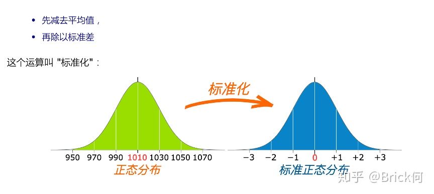

### 正态分布

> 学习资料：[一文搞懂“正态分布”所有需要的知识点](https://zhuanlan.zhihu.com/p/128809461)

#### 概率密度函数

**曲线越高，也就代表着这个区间的概率越密集**，简单理解成在同样大小的房子里，这个房间的人数更多、更挤。除此之外，**另一个关于概率密度函数的重要知识点是，积分（面积）等于概率**.

#### 均值和标准差

**均值**
$$
μ = ∑(xi)／N
$$
**标准差**
$$
σ = \sqrt{σ^{2}} = \sqrt{\frac{\sum (x_{i} - \bar{x})^{2}}{N - 1}}
$$

1. 概率密度曲线在均值处达到最大，并且对称；
2. 一旦均值和标准差确定，正态分布曲线也就确定；
3. 当X的取值向横轴左右两个方向无限延伸时，曲线的两个尾端也无限渐近横轴，理论上永远不会与之相交；
4. 正态随机变量在特定区间上的取值概率由正态曲线下的面积给出，而且其曲线下的总面积等于1 ；
5. 均值可取实数轴上的任意数值，决定正态曲线的具体位置；标准差决定曲线的“陡峭”或“扁平”程度：标准差越大，正态曲线越扁平；标准差越小，正态曲线越陡峭。

#### 标准化

通过标准化，所有服从一般正态分布的随机变量都变成了服从**均值**为0，**标准差**为1的标准正态分布。

$$
X' = (X - μ) / σ
$$

### 高斯过程

> 学习资料：
>
> [多元高斯分布（The Multivariate normal distribution](https://www.cnblogs.com/bingjianing/p/9117330.html)
>
> [高斯过程 Gaussian Processes 原理、可视化及代码实现](https://zhuanlan.zhihu.com/p/75589452)

#### 标准高斯函数

$$
f(x) = \frac{1}{\sqrt{2π}}e^{-\frac{x^2}{2}}
$$

#### 一元高斯分布

$$
f(x) = \frac{1}{σ\sqrt{2π}}exp^{-\frac{(x-μ)^2}{2σ^{2}}}
$$

其中μ和 σ 分别表示均值和方差，这个概率密度函数曲线画出来就是我们熟悉的钟形曲线，均值和方差唯一地决定了曲线的形状。

我们可以令：
$$
z = \frac{x - μ}{σ}
$$
称这个过程为标准化， 不难理解，z∼N(0,1)z∼N(0,1)，从z -> x的过程如下：

Ⅰ， 将 x 向右移动 μ 个单位

Ⅱ， 将密度函数伸展 σ 倍

而标准化(x -> z)所做的事情就是上述步骤的逆向

实线代表的函数是标准高斯函数，虚线代表的是标准高斯函数在 x 轴方向2倍延展

### 贝叶斯优化

> 学习资料：[理解贝叶斯优化](https://zhuanlan.zhihu.com/p/146633409)

贝叶斯优化的思路是首先生成一个初始候选解集合，然后根据这些点寻找下一个最有可能是极值的点，将该点加入集合中，重复这一步骤，直至迭代终止。最后从这些点中找出函数值最大的点作为问题的解。

这里的关键问题是如何根据已经搜索的点确定下一个搜索点，通过高斯过程回归和采集函数实现。高斯过程回归根据已经搜索的点估计其他点处目标函数值的均值和方差，如图所示。图中蓝色实线为真实的目标函数曲线，黑色虚线为算法估计出的在每一点处的目标函数值。图中有7个已经搜索的点，用红色点表示。蓝色带状区域为在每一点处函数值的置信区间。函数值在以均值，即黑色虚线为中心，与标准差成正比的区间内波动。图5的下图为采集函数曲线，下一个采样点为采集函数的极大值点，以五角星表示。

贝叶斯优化算法的流程如下所示：

**其核心由两部分构成**：

1. 高斯过程回归：计算每一点处函数值的均值和方差；

2. 根据均值和方差构造采集函数，用于决定本次迭代时在哪个点处进行采样。

算法首先初始化 ![[公式]](https://www.zhihu.com/equation?tex=n_%7B0%7D) 个候选解，通常在整个可行域内均匀地选取一些点。然后开始循环，每次增加一个点，直至找到 ![[公式]](https://www.zhihu.com/equation?tex=N) 个候选解。每次寻找下一个点时，用已经找到的 ![[公式]](https://www.zhihu.com/equation?tex=n) 个候选解**建立高斯回归模型**，得到任意点处的函数值的后验概率。然后根据后验概率**构造采集函数**，**寻找函数的极大值点作为下一个搜索点**。接下来计算在下一个搜索点处的函数值。算法最后返回 ![[公式]](https://www.zhihu.com/equation?tex=N) 个候选解的极大值作为最优解。

**采集函数的构造**

采集函数用于确定在何处采集下一个样本点，它需要满足下面的条件。

1. 在已有的采样点处采集函数的值更小，因为这些点已经被探索过，再在这些点处计算函数值对解决问题没有什么用；

2. 在置信区间更宽的点处采集函数的值更大，因为这些点具有更大的不确定性，更值得探索；

3. 在函数均值更大的点处采集函数的值更大，因为均值是对该点处函数值的估计值，这些点更可能在极值点附近。
