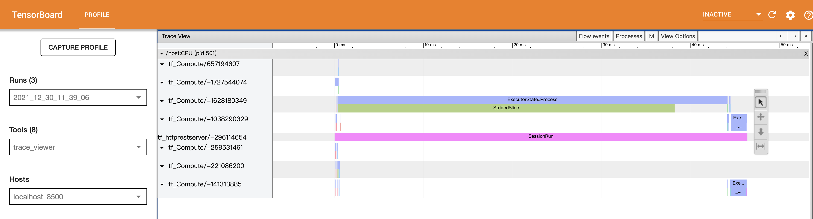

### 优化思路

针对Embedding+MLP的排序模型，通常有**延时低**、**吞吐量高**、**Batch大**的特点，因此需要优化原生Tensorflow Serving以满足业务的需求。单点优化难以完全满足优化的目标，因此需要体系化进行优化，这就包括了：

- **CPU选型**：由于模型推理是一个计算密集型任务，因此选用现代的CPU架构以及支持`SSE/AVX`指令集会带来一定的性能提升，另外`Intel`和`AMD`的CPU也有一定差异，在我们的场景里选择Intel CPU带来显著的性能提升；
- **Profiling工具**：合适的`Benchmark`和`Profiling`工具有助于快速定位性能问题，可以借助`TensorBoard`的可视化更为直观地定位计算图中各个算子的准确时延；
- **Tensorflow Serving参数优化**：`Tensorflow Serving`自身提供了一系列的优化参数，包括启用Batch预测，以及`Tensorflow`计算Session中的线程数量；
- **MKL优化**：`MKL`为Intel开发的基于Intel CPU的数据计算加速库，通过在编译`Tensorflow`时启用`MKL`编译并设置合适的参数有可能提升`Tensorflow Serving`在Intel CPU上的性能表现；
- **图结构优化**：生成的用于`Serving`的`Tensorflow`模型可能存在冗余的变量、仅用于训练阶段的算子，我们可以通过优化`Tensorflow`模型来进一步优化`Serving`时的性能；
- **量化**：通过转换模型精度来提升模型性能。

### Inference Profiling

在模型部署上线后，可以借助`TensorBoard`进行模型性能调试，参考[Profile Inference Requests with TensorBoard](https://www.tensorflow.org/tfx/serving/tensorboard)对TensorFlow Sering在线模型进行profiling。

> 注意：安装匹配的tensorboard及相关插件，否则不能正常追踪调用数据

```properties
tensorboard                2.4.1
tensorboard-data-server    0.6.1
tensorboard-plugin-profile 2.4.0
tensorboard-plugin-wit     1.8.0
tensorflow                 2.4.1
tensorflow-estimator       2.4.0
```

**启动模型**

启动模型，并挂在共享目录存储profiling文件

```bash
docker pull tensorflow/serving
MODELS_DIR="$(pwd)/tensorflow_serving/servables/tensorflow/testdata"
docker run -it --rm -p 8500:8500 -p 8501:8501 \
-v $MODELS_DIR/saved_model_half_plus_two_cpu:/models/half_plus_two \
-v /tmp/tensorboard:/tmp/tensorboard \
-e MODEL_NAME=half_plus_two \
tensorflow/serving
```

**启动Tensorboard**

启动Tensorboard，挂载日志目录

```bash
mkdir -p /tmp/tensorboard
tensorboard --logdir /tmp/tensorboard --port 6006
```

**抓取Profiling数据**


打开[Profiling](http://localhost:6006/#profile)，点击`Capture`开始抓取，同时发送HTTP或GRPC请求，抓取成功后会在日志目录生成profling文件：

```bash
ls -lts /tmp/tensorboard/plugins/profile 
total 0
0 drwxr-xr-x  3 sanders  wheel  96 12 28 09:57 2021_12_28_09_57_00
0 drwxr-xr-x  3 sanders  wheel  96 12 28 09:42 2021_12_28_09_41_47
0 drwxr-xr-x  3 sanders  wheel  96 12 28 09:41 2021_12_28_09_40_52
0 drwxr-xr-x  3 sanders  wheel  96 12 28 09:26 2021_12_28_09_26_08
```

**模型Profiling**

打开Run实例的`trace_viewer`分析调用链路中的性能瓶颈



### Batch 优化

**Batching设置**

通过`--enable_batching`启动批量预测，在`--batching_parameters_file`文件中指的批量参数

> 参考[CPU-only: One Approach](https://github.com/tensorflow/serving/blob/master/tensorflow_serving/batching/README.md#cpu-only-one-approach)
>
> num_batch_threads: CPU核数
>
> batch_timeout_micros：调整 max_batch_size，在延时和吞吐量直接找到一个最大延时的时间

```json
max_batch_size { value: 256 }
batch_timeout_micros { value: 0 }
max_enqueued_batches { value: 1000000 }
num_batch_threads { value: 8 }
```

### MKL优化

`MKL`为Intel开发的基于Intel CPU的数据计算加速库，通过在编译`Tensorflow`时启用`MKL`编译并设置合适的参数可以提升Tensorflow Serving在Intel CPU上的性能表现。

**修改Dockerfile**

> 编译1.15.0版本需要修改Dockerfile文件：`vim tensorflow_serving/tools/docker/Dockerfile.devel-mkl`

```dockerfile
### Install python3-distutils
RUN apt-get update && apt-get install -y --no-install-recommends \
        automake \
        build-essential \
        ca-certificates \
        curl \
        git \
        libcurl3-dev \
        libfreetype6-dev \
        libpng-dev \
        libtool \
        libzmq3-dev \
        mlocate \
        openjdk-8-jdk\
        openjdk-8-jre-headless \
        pkg-config \
        python-dev \
        software-properties-common \
        swig \
        unzip \
        wget \
        zip \
        zlib1g-dev \
        libomp-dev \
        gpg-agent \
        && \
    apt-get clean && \
    rm -rf /var/lib/apt/lists/*

# Install MKL
RUN cd /tmp && \
    wget https://apt.repos.intel.com/intel-gpg-keys/GPG-PUB-KEY-INTEL-SW-PRODUCTS-2019.PUB && \
    apt-key add GPG-PUB-KEY-INTEL-SW-PRODUCTS-2019.PUB && \
    rm GPG-PUB-KEY-INTEL-SW-PRODUCTS-2019.PUB

RUN wget https://apt.repos.intel.com/setup/intelproducts.list -O /etc/apt/sources.list.d/intelproducts.list

RUN apt-get update && apt-get install -y --no-install-recommends \
        intel-mkl-2019.5-075 \
        && \
    apt-get clean && \
    rm -rf /var/lib/apt/lists/* \

# get-pip.py for Python2.7
RUN curl -fSsL -O \
    https://bootstrap.pypa.io/pip/2.7/get-pip.py && \
    python get-pip.py && \
    rm get-pip.py
```

**编译Docker镜像**

```bash
docker build --pull --network=host -t [DOCER_REPO]/tensorflow-serving:1.15.0-devel-mkl \
    --build-arg TF_SERVING_VERSION_GIT_BRANCH=1.15.0 \
    --build-arg TF_SERVING_VERSION_GIT_COMMIT=748217e48b006cb0d8d87d362bce88cd5f292a73 \
    --build-arg TF_SERVING_BUILD_OPTIONS="--config=release --config=mkl --config=nativeopt --copt=-mavx --copt=-mavx2 --copt=-mfma --copt=-msse4.2" \
    -f tensorflow_serving/tools/docker/Dockerfile.devel-mkl .

docker build --network=host -t [DOCER_REPO]/tensorflow-serving:1.15.0-mkl \
    --build-arg TF_SERVING_VERSION=1.15.0 \
    --build-arg TF_SERVING_BUILD_IMAGE=[DOCER_REPO]/tensorflow-serving:1.15.0-devel-mkl \
    --build-arg TF_SERVING_VERSION_GIT_COMMIT=748217e48b006cb0d8d87d362bce88cd5f292a73 \
    --build-arg TF_SERVING_VERSION_GIT_BRANCH=1.15.0 \
    -f tensorflow_serving/tools/docker/Dockerfile.mkl .
```

**并行参数设置方法**

```shell
export TENSORFLOW_INTER_OP_PARALLELISM=2
# For an EC2 c5.18xlarge instance, number of logical cores = 72
export TENSORFLOW_INTRA_OP_PARALLELISM=72
# For an EC2 c5.18xlarge instance, number of physical cores = 36
export OMP_NUM_THREADS=36
export KMP_AFFINITY='granularity=fine,verbose,compact,1,0'
# For an EC2 c5.18xlarge instance, number of physical cores / 4 = 36 /4 = 9
export TENSORFLOW_SESSION_PARALLELISM=9
export KMP_BLOCKTIME=1
export KMP_SETTINGS=0
```

> 参考：
>
> [AmazonDeep Learning Containers 英特尔数学核心库 (MKL) 建议](https://docs.amazonaws.cn/deep-learning-containers/latest/devguide/deep-learning-containers-mkl.html)
>
> [General Best Practices for Intel® Optimization for TensorFlow](https://github.com/IntelAI/models/blob/master/docs/general/tensorflow/GeneralBestPractices.md)

### 预训练模型优化

优化TensorFlow预训练模型有助于提升在线模型的性能，优化主要有两个关键步骤：`freeze graph`和`optimize for inference`。

**模型输入输出**

首先通过`saved_model_cli`可以查看原是模型结构的输入输出

```bash
saved_model_cli show \
	--dir=release/202112211640131053 --all
```

此模型的输入输出为：

```yaml
MetaGraphDef with tag-set: 'serve' contains the following SignatureDefs:

signature_def['serving_default']:
  The given SavedModel SignatureDef contains the following input(s):
    inputs['feat_ids'] tensor_info:
        dtype: DT_INT32
        shape: (-1, 875)
        name: feat_ids_1:0
    inputs['feat_vals'] tensor_info:
        dtype: DT_FLOAT
        shape: (-1, 875)
        name: feat_vals_1:0
  The given SavedModel SignatureDef contains the following output(s):
    outputs['label'] tensor_info:
        dtype: DT_FLOAT
        shape: (-1)
        name: DeepFM-out/Sigmoid:0
  Method name is: tensorflow/serving/predict
```

**Freeze Graph**

`Freeze Graph`将不同文件中变量合并到`GraphDef`中，以便后续优化是对模型进行节点合并，剪枝，模型结构优化。同时将`SavedModel`中的参数常量和`Checkpoint`文件中的变量合并，这回进一步减少变量冗余并提升计算速度。

```bash
docker run -it --network=host \
  -v /data/home/xishengzhao/workspace/:/home/workspace/ \
  [DOCER_REPO]/tensorflow-serving:1.15.0-base_build \
  /bin/bash
```

执行`Freeze Graph`

```bash
cd /home/workspace/tensorflow-1.15.0
bazel build \
	tensorflow/python/tools:freeze_graph && \
	bazel-bin/tensorflow/python/tools/freeze_graph \
	--input_binary=True \
	--input_saved_model_dir=/home/workspace/release/202112211640131053/ \
	--output_graph=/home/workspace/opt/frozen_graph.pb \
	--output_node_names=DeepFM-out/Sigmoid
	
cd /home/workspace/tensorflow-1.15.0
bazel build \
	tensorflow/python/tools:freeze_graph && \
	bazel-bin/tensorflow/python/tools/freeze_graph \
	--input_binary=True \
	--input_saved_model_dir=/home/workspace/main_page_fund_slot2/202112291640829159/ \
	--output_graph=/home/workspace/main_page_fund_slot2/opt/frozen_graph.pb \
	--output_node_names=DeepFM-out/Sigmoid,DeepFM-out/Sigmoid
```

输出Freeze结果：

```
I1230 11:20:26.227493 140183528183616 graph_util_impl.py:334] Froze 12 variables.
I1230 11:20:26.304270 140183528183616 graph_util_impl.py:394] Converted 12 variables to const ops.
---------------------------------------------------------------------------------
I1231 06:45:55.640544 140282112374592 graph_util_impl.py:334] Froze 35 variables.
I1231 06:45:58.051263 140282112374592 graph_util_impl.py:394] Converted 35 variables to const ops.
```

**Optimize for Inference**

`Optimize for Inference`步骤主要执行以下优化：

1. 移除训练只存在于训练中的操作，例如保存checkpoint。
2. 剥离Graph中访问不到的部分。
3. 删除debug操作，例如CheckNumerics。
4. 进行batch normalization操作折叠，转化成预计算weights。
5. 通用操作融合。

````bash
bazel build tensorflow/python/tools:optimize_for_inference && \
	bazel-bin/tensorflow/python/tools/optimize_for_inference \
	--input=/home/workspace/opt/frozen_graph.pb \
	--output=/home/workspace/opt/optmized_graph.pb \
	--frozen_graph=True \
	--input_names=feat_ids_1,feat_vals_1 \
	--placeholder_type_enum=3,1 \
	--output_names=DeepFM-out/Sigmoid

bazel build tensorflow/python/tools:optimize_for_inference && \
	bazel-bin/tensorflow/python/tools/optimize_for_inference \
	--input=/home/workspace/main_page_fund_slot2/opt/frozen_graph.pb \
	--output=/home/workspace/main_page_fund_slot2/opt/optmized_graph.pb \
	--frozen_graph=True \
	--input_names=feat_ids_1,feat_vals_1,pad_fund_list_1,pad_multi_fund_list_1,pad_sideinfo_list_1 \
	--placeholder_type_enum=3,1,3,3,1,3 \
	--output_names=DeepFM-out/Sigmoid,DeepFM-out/Sigmoid
````

### 优化过程

**Tensorflow Serving基础配置**

```yaml
- hpaSpec:
    maxReplicas: 16  # 最大实例数，实例数目的两倍
    minReplicas: 16  # 最小实例数
resources:
  requests:
    cpu: 4      # 如：500m
    memory: 6Gi # 如：512Mi
  limits:
    cpu: 4      # 如：500m
    memory: 6Gi # 如：512Mi
```

**压测客户端配置**

并行度配置为：

````json
concurency: 12
batch_size: 400
````

资源配置为：

```yaml
resources:
  limits:
    cpu: 4      # 1C
    memory: 4Gi # 2G
```

**基线性能**

> TPS: 162
>
> CPU: 190%

| 延时等级 | 优化前  |
| -------- | ------- |
| P50      | 0.02316 |
| P75      | 0.03550 |
| P90      | 0.04420 |
| P95      | 0.04710 |
| P99      | 0.04942 |

**Optimize for Inference之后**

> TPS: 155
>
> CPU: 148%

| 延时等级 | 优化后 | 优化前 | 提升    |
| -------- | ------ | ------ | ------- |
| P50      | 0.031  | 0.0232 | -25.29% |
| P75      | 0.0407 | 0.0355 | -12.78% |
| P90      | 0.0462 | 0.0442 | -4.33%  |
| P95      | 0.0482 | 0.0471 | -2.28%  |
| P99      | 0.0498 | 0.0494 | -0.76%  |

**Tensorflow Serving参数优化**

```yaml
- --tensorflow_intra_op_parallelism=4 # 8
- --tensorflow_inter_op_parallelism=2 # 1
- --enable_batching=true
- --batching_parameters_file=/models/release/batching_config
image: [DOCER_REPO]/tensorflow-serving:1.15.0
```

> TPS 139
>
> CPU: 60%

| 延时等级 | 优化后 | 优化前 | 提升    |
| -------- | ------ | ------ | ------- |
| P50      | 0.0259 | 0.0232 | -10.41% |
| P75      | 0.0379 | 0.0355 | -6.43%  |
| P90      | 0.0452 | 0.0442 | -2.19%  |
| P95      | 0.0476 | 0.0471 | -1.07%  |
| P99      | 0.0495 | 0.0494 | -0.24%  |

**升级TFS版本**

```yaml
- --tensorflow_intra_op_parallelism=4 # 8
- --tensorflow_inter_op_parallelism=2 # 1
- --enable_batching=true
- --batching_parameters_file=/models/release/batching_config
image: [DOCER_REPO]/intel_tensorflow-serving:2.5.1-mkl
```

> TPS 128
>
> CPU: 51%

| 延时等级 | 优化后 | 优化前 | 提升    |
| -------- | ------ | ------ | ------- |
| P50      | 0.0329 | 0.0232 | -29.60% |
| P75      | 0.0431 | 0.0355 | -17.63% |
| P90      | 0.0495 | 0.0442 | -10.71% |
| P95      | 0.0618 | 0.0471 | -23.79% |
| P99      | 0.0731 | 0.0494 | -32.39% |

**Freeze及优化后的模型**

模型优化后

```yaml
- --tensorflow_intra_op_parallelism=4 # 8
- --tensorflow_inter_op_parallelism=2 # 1
- --enable_batching=true
- --batching_parameters_file=/models/release/batching_config
image: [DOCER_REPO]/tensorflow-serving:1.15.0
```

> TPS 135
>
> CPU: 62%

| 延时等级 | 优化前 | 优化后 | 提升    |
| -------- | ------ | ------ | ------- |
| P50      | 0.0329 | 0.0232 | -29.58% |
| P75      | 0.0414 | 0.0355 | -14.15% |
| P90      | 0.0446 | 0.0442 | -0.90%  |
| P95      | 0.0484 | 0.0471 | -2.69%  |
| P99      | 0.0498 | 0.0494 | -0.72%  |

**intra_op:8**

模型优化后

```yaml
- --tensorflow_intra_op_parallelism=8 # 8
- --tensorflow_inter_op_parallelism=2 # 1
- --enable_batching=true
- --batching_parameters_file=/models/release/batching_config
image: [DOCER_REPO]/tensorflow-serving:1.15.0
```

> TPS 131
>
> CPU: 77%

| 延时等级 | 优化后 | 优化前 | 提升   |
| -------- | ------ | ------ | ------ |
| P50      | 0.018  | 0.0232 | 28.67% |
| P75      | 0.0221 | 0.0355 | 60.63% |
| P90      | 0.0245 | 0.0442 | 80.41% |
| P95      | 0.0352 | 0.0471 | 33.81% |
| P99      | 0.0469 | 0.0494 | 5.37%  |

**intra_op:16**

模型优化后

```yaml
- --tensorflow_intra_op_parallelism=16 # 8
- --tensorflow_inter_op_parallelism=2 # 1
- --enable_batching=true
- --batching_parameters_file=/models/release/batching_config
image: [DOCER_REPO]/tensorflow-serving:1.15.0
```

> TPS 176
>
> CPU: 130%

| 延时等级 | 优化后 | 优化前 | 提升  |
| -------- | ------ | ------ | ----- |
| P50      | 0.0226 | 0.0232 | 2.48% |
| P75      | 0.034  | 0.0355 | 4.41% |
| P90      | 0.0436 | 0.0442 | 1.38% |
| P95      | 0.0468 | 0.0471 | 0.64% |
| P99      | 0.0494 | 0.0494 | 0.04% |

**intra_op:16, inter_op:1**

模型优化后

```yaml
- --tensorflow_intra_op_parallelism=16 # 8
- --tensorflow_inter_op_parallelism=1 # 1
- --enable_batching=true
- --batching_parameters_file=/models/release/batching_config
image: [DOCER_REPO]/tensorflow-serving:1.15.0
```

> TPS 180
>
> CPU: 125%

| 延时等级 | 优化前 | 优化后 | 提升   |
| -------- | ------ | ------ | ------ |
| P50      | 0.0199 | 0.0232 | 16.15% |
| P75      | 0.0249 | 0.0355 | 42.46% |
| P90      | 0.0411 | 0.0442 | 7.44%  |
| P95      | 0.0456 | 0.0471 | 3.36%  |
| P99      | 0.0491 | 0.0494 | 0.63%  |

**intra_op:8**

模型优化前

```yaml
- --tensorflow_intra_op_parallelism=8 # 8
- --tensorflow_inter_op_parallelism=2 # 1
- --enable_batching=true
- --batching_parameters_file=/models/release/batching_config
image: [DOCER_REPO]/tensorflow-serving:1.15.0
```

> TPS 125
>
> CPU: 76%

| 延时等级 | 优化后 | 优化前 | 提升   |
| -------- | ------ | ------ | ------ |
| P50      | 0.019  | 0.0232 | 21.77% |
| P75      | 0.0236 | 0.0355 | 50.74% |
| P90      | 0.0355 | 0.0442 | 24.51% |
| P95      | 0.0428 | 0.0471 | 10.07% |
| P99      | 0.0486 | 0.0494 | 1.65%  |

### 精度影响

**优化前**

```json
{  
    "predictions": [0.015243181]
}
```

**优化后**

```json
{  
    "predictions": [0.015243181]
}
```

### 其他

**Tensorflow模型定义**

```yaml
apiVersion: machinelearning.seldon.io/v1
kind: SeldonDeployment
metadata:
  name: mmoe
  namespace: seldon
spec:
  protocol: tensorflow
  predictors:
  - componentSpecs:
    - spec:
        containers:
        - args:
          - --port=8500
          - --rest_api_port=8501
          - --model_name=mmoe
          - --model_base_path=/mnt/models/mmoe
          - --enable_batching=true
          - --batching_parameter_file=/mnt/models/batching_config
          - --tensorflow_intra_op_parallelism=2
          - --tensorflow_inter_op_parallelism=8
          image: zxsimple/tf-serving-mkl:1.15.0
          docker pull zxsimple/tf-serving:1.15.0-mkl
          env:
          - name: OMP_NUM_THREADS
            value: "1"
          - name: TENSORFLOW_SESSION_PARALLELISM
            value: "1"
          name: mmoe
          ports:
          - containerPort: 8501
            name: http
            protocol: TCP
          - containerPort: 8500
            name: grpc
            protocol: TCP
          volumeMounts:
          - name: model-repo
            mountPath: /mnt/models
        volumes:
        - name: model-repo
          hostPath:
            path: /root/infra/Seldon/models
    graph:
      name: mmoe
      type: MODEL
      endpoint:
        httpPort: 8501
        grpcPort: 8500
    name: model
    replicas: 1
```

### 参考资料

- [Optimizing TensorFlow Models for Serving](https://medium.com/google-cloud/optimizing-tensorflow-models-for-serving-959080e9ddbf)

- [Tensorflow tools](https://github.com/tensorflow/tensorflow/tree/v1.15.0/tensorflow/python/tools)
- [Maximize TensorFlow* Performance on CPU: Considerations and Recommendations for Inference Workloads](https://www.intel.cn/content/www/cn/zh/developer/articles/technical/maximize-tensorflow-performance-on-cpu-considerations-and-recommendations-for-inference.html)
- [Optimize TensorFlow Pre-trained Model for Inference](https://www.intel.com/content/www/us/en/developer/articles/technical/optimize-tensorflow-pre-trained-model-inference.html)

