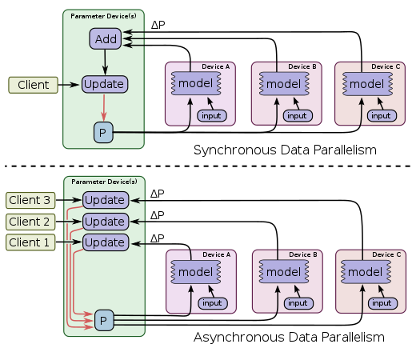

**用户数据大规模积累、用户体验需求的升级以及算力革新和计算模型的演进**这三大核心要素及其相互作用成为现在和未来基于网络互联用户活动的主要组成部分。机器学习平台作为使数据、计算和用户体验三者相互作用的关键基础设施。

**数据**

用户在APP上每个点击，划过，从一个APP切换到另一APP，在每个页面的停留，甚至浏览的注意力和速度；屏幕、电池、GPS定位、运动传感器......等设备的运行数据。人们的各种数据无时不刻的被记录、存储和计算。

数据的用途也从事务交易、统计分析到体验优化进行了一个完整的周期迭代。

**算力&计算模型**

从单核CPU到HPC，再到基于微内核的GPU，外存和内存容量和速度的不断增长，万兆网络、InfiniBand、RDMA网络技术的发展和应用。我们走过的短短数十年中，算力的革新已经是有很大的变化，同时适配于计算硬件的新的计算模型的发展：基于分布式的RPC，基于低I/O成本的MapReduce，基于GPU的矩阵运算等也在影响着软件开发的变革。

**用户体验**

最开始用户是在基于命令行/桌面进行指令性应用交互，随后在门户时代是基于类目组织的信息浏览，搜索引擎给我们带来的是用户主动信息检索，而今各种Feed大行其道。用户在“懒”的道路上一路向前，用户参与更广、更深，信息获取更加简单高效。

用户、数据和计算正在以前所未有的程度参与并加速重构人类生活方式。

*https://www.kinetica.com/blog/gpu-computing-revolutionizing-real-time-analytics-retail-cpg-logistics-supply-chain/*

### 全栈机器学习平台

一个良好的机器学习平台产品需要贯穿整个数据科学的完整生命周期。在产品方面需要考虑到：

- 全栈用户体验

  用户数据科学的所有活动需要在一个产品中**无缝**且**无差别体验**地完成，这是解放数据科学家生产力，服务数据科学家聚焦于其核心工作的基础

- 工程能力和数据科学解耦

  完成一个完整的数据接入、特征处理、模型训练优化及模型上线服务的整体工作，尤其在面向大规模/超大规模数据和模型的情况下，数据存储格式，多机多卡协同计算，资源调度管理，模型弹性伸缩等等工程化工作是必不可少的。让用户对无感知或者提供易用的自定义完成对复杂工程的应用

- 开放性

  通常一个团队中的数据科学具有不同的技术背景，不同的计算框架有其特定，通用的机器学习平台面向的场景和任务具有多样性；平台要对变化开发，以高效的方式支持不同用户的需求

### 关键架构因素

构建机器学习平台需要的技术包括了存储、通信、计算、分布式、资源管理等计算机体现中的很多技术，在时间、资源因素的限定条件下设计一个面向业务且具有生命力的机器学习平台架构，需要考虑诸多因素：

**遗留系统集成**

通常在组织中已经存在数据存储、资源调度和任务调度系统，架构设计需要拥抱这些遗留系统。对遗留系统良好的集成不仅可以提升用户体验，降低系统复杂程度，还可以缩短实现周期

**数据和模型规模**

数据量、模型的复杂程度和规模以及用户对模型训练周期的容忍度决定了技术选型和核心能力的设计方式

**资源管理调度**

依托于Kubernetes或者YARN设计资源队列，进行异构资源管理调度，确保资源的合理高效利用

**Pipeline**

一方面对数据接入、特征工程、训练及上线等环节通过Pipeline组织，驱动数据在不同计算组件中运转起来，合理利用内存共享，避免低效I/O，从而系统性降低数据处理周期

**Serving系统**

Serving是一个相对独立的子系统，需要考虑E2E预测延时，弹性伸缩能力，模型版本管理，监控，A/B分流等能力，一般Serving都是无状态的，适合用微服务的架构来实现

**数据存储和表示**

在数据源，特征工程及模型训练阶段数据可能以不同形式存储在不同的介质上；同时数据有Dense或者Sparse不同特点，以及数据可能存储在单机或者分布式多节点上。需要考虑数据存储格式，存储介质，分布式表示方式

**并行化**

并行化不仅仅存在于训练阶段，同样存在于数据访问，特征处理甚至在Serving阶段

**计算加速**

除了基于GPU的CUDA加速，我们同样可以在Intel CPU上用合适的计算库来实现加速

**网络通信**

尤其在训练复杂网络的情况下，通信可能是主要的性能瓶颈；合理的网络拓扑和连接方式，以及采用高效的通信协议会降低计算等待

### 架构设计

> 此处我们以面向：
>
> - 存储在HDFS上TB级用户和物品数据
> - 训练面向CTR场景的Embedding+MLP结构的模型
> - 提供在线低延时且可弹性伸缩的排序服务
>
> 这样一个具有通用场景展开机器学习平台的架构设计

大部分数据都存储在Hadoop平台之上，现有的数据处理框架都采用Spark进行数据ETL，特征工程，数据工程师/数据科学家的技术栈也已Spark为主。对机器学习/深度学习的模型训练需要无缝对接OneData集群，大数据搬移是一个很耗时的过程，避免数据搬移对加速模型训练会有很大的提升。

我们可以通过X on Spark，将大量外部计算框架和Spark结合起来，这样就可以统一计算和数据存储；而在这个过程中我们需要解决的主要问题是计算框架对于Kerberos认证机制的打通。

## 特征存储及分布式表示

### 内存特征、向量、矩阵进行存储，数据列式存储

> Apache Arrow 是 Apache 基金会的顶级项目之一，目的是作为一个跨平台的数据层来加快大数据分析项目的运行速度。它包含一组规范的内存中的平面和分层数据表示，以及多种语言绑定以进行结构操作。 它还提供低架构流式传输和批量消息传递，零拷贝进程间通信（IPC）和矢量化的内存分析库。

计算机系统中设备的R/W速度与它的成本成正比，现在计算机中的RAM成本和容量都足以支持大数据的存储和计算，通过内存存储可以实现对大数据的加速；Hadoop原本是基于网络和磁盘I/O设计的，对内存的使用率不高，因此增加对内存的使用率可以有效提高大数据处理的效率。

### 向量/矩阵分布式表示，稀疏特征压缩

在分布式机器学习计算中对分布式向量和矩阵的分布式表示以及对稀疏特征的压缩处理可以提高数据的并行计算度和存储压缩比，Spark中会采用`RowMatrix`,`CoordinateMatrix`和`BlockMatrix`等存储来对不同形式的[数据类型](https://spark.apache.org/docs/latest/mllib-data-types.html)进行矩阵进表示，而在腾讯新一代机器学习框架`PS2`中，采用`Dimension Co-located Vector (DCV)`进行分布式向量优化。

业界也有很多标准的数据存储表示来对不同场景的向量矩阵进行优化。

- Coordinate Format (COO)
- Compressed sparse row (CSR)
- Column Storage formats (CSC)
- Block Coordinate storage format (BCO)
- Block Sparse Row (BSR)
- Column storage format (BSC)
- Java Sparse Array (JSA)
- Dimension Co-located Vector (DCV)

其中`Dimension Co-located Vector (DCV)`对Spark ML的优化有比较大的性能提升。

## 矩阵计算加速

Spark兴起的时代GPU的应用十分有限，而近期深度学习在CV领域的突破促进了GPU加速的广泛应用，而传统基于Python的机器学习框架`sklearn`也不支持GPU加速。

| Spark            | Angel          | XDL      | Tensorflow             | MXNet                 |
| ---------------- | -------------- | -------- | ---------------------- | --------------------- |
| F2J/MKL/OpenBlas | OpenBLAS/Math2 | MKL/CUDA | MKL/MKL-DNN/CUDA/Eigen | OpenBLAS/CUDA/MKL-DNN |

Intel的`MKL(Math Kernal Library)`提供数据计算库在Intel架构CPU上可以发挥多核多线程优势，加速数学计算；

NVIDIA推出的运算平台CUDA（Compute Unified Device Architecture）是通用并行计算架构，结合GPU微核计算，更是大规模提升了神经网络中矩阵的技术速度；

而在开源界也有[OpenBLAS](https://github.com/xianyi/OpenBLAS)，[netlib-java](https://github.com/fommil/netlib-java)，[F2J](http://icl.cs.utk.edu/f2j/)，[Breeze](https://github.com/scalanlp/breeze)等众多数学计算库进行数学计算处理，而这些库一般是运行在通用CPU架构上，因此性能相比前者有明显落后。

| Blas         | Time     |
| ------------ | -------- |
| F2JBlas      | 2.6 hrs  |
| MKL (HT=ON)  | 0.72 hrs |
| MKL (HT=OFF) | 0.33 hrs |
| OpenBlas     | 26 hrs   |

业务的现状是，在数据平台中存在着大量异构的计算处理单元架构，包括Intel CPU，Nvidia GPU和达芬奇架构的昇腾芯片；因此在通用性和性能之间的平衡中，我们需要支持MKL/CUDA/DDK计算加速库来实现不同场景和运行时的数学计算加速。

在实际CTR场景中我们要支持一个DeepFM模型在线20000TPS的请求，采用[Angel Math2](https://github.com/Angel-ML/math2)在Intel`24 cores, Intel(R) Xeon(R) Gold 6151 CPU @ 3.00GHz`上预估需要153台节点才能满足业务需求。在我们的测试服务器上CPU的使用率已经高达80%以上。随着我们更多，更复杂模型在线上的部署，必须要采用针对对专有芯片的数学计算库才能有效降低资源开销。

## 并行计算

在大规模数据和模型训练的场景中，由于训练样本规模大或者网络参数大，通常单个节点不能完成对模型的训练，这时就需要多节点协同的方式完成模型的训练，采用分而治之的思想。一般会有数据并行和模型并行两种思路来实现任务的分解和并行训练。

### 数据并行

为不同的计算节点保留同一个模型的副本，每个节点分配到不同的数据，每个节点在本地计算持有数据的模型参数，然后将所有计算节点的计算结果按照某种方式合并生成最终的模型。

在这个过程中数据拆分的方式可以是随机的方式，也可以采用shuffle机制保证数据样本的均衡；而参数同步和合并方式主流的有`Parameter Server`和`Ring All-Reduce`方式。

#### Parameter Server

在Parameter Server架构中，集群中的节点被分为两类：Parameter Server和Worker。其中Parameter Server存放模型的参数，而Worker负责计算参数的梯度。在每个迭代过程，Worker从Parameter Sever中获得参数，然后将计算的梯度返回给Parameter Server，Parameter Server聚合从Worker传回的梯度，然后更新参数，并将新的参数广播给Worker。

其中参数在Parameter Server和Worker之间的同步既可以是同步的(Synchronous)，也可以是异步的(Asynchronous)。

#### Ring AllReduce

在Ring-Allreduce架构中，各个节点都是Worker，没有中心节点来聚合所有Worker计算的梯度。在一个迭代过程，每个Worker完成自己的mini-batch训练，计算出梯度，并将梯度传递给环中的下一个Worker，同时它也接收从上一个Worker的梯度。对于一个包含N个Worker的环，各个Worker需要收到其它N-1个worker的梯度后就可以更新模型参数。

### 模型并行

如果训练模型的规模很大，不能在每个计算节点的本地内存中完全存储，那么就可以对模型进行划分，然后每个计算节点负责对本地局部模型的参数进行更新。通常对线性可分的模型和非线性模型（神经网络），模型并行的方法也会有所不同。

- 线性模型

  把模型和数据按照特征维度进行划分，分配到不同的计算节点上，在每个计算节点上采用梯度下降优化算法进行优化，局部的模型参数计算不依赖于其他维度的特征，相对独立，那么就不需要与其他节点进行参数交换。

  在Angel的实现中就主要使用模型并行的方法使用`ModelPartitioner`实现模型分布式计算。

  

- 神经网络

  神经网络中模型具有很强的非线性性，参数之间有较强的关联依赖，通常可以横向按层划分或纵向跨层划分进行网络划分。每个计算节点计算局部参数然后通过RPC将参数传递到其他节点上进行参数的合并，复杂的神经网络需要较高的网络带宽来完成节点之间的通信。

#### CTR模型并行训练

通常典型深度CTR模型是**Embedding Layer + MLP**结构；对于10亿特征，Embedding Size为16的CTR模型来说Embedding模型的大小为10^9 * 16 * 4B ≈ 60GB，而MLP的大小只有几个MB。训练Embedding网络的效率将会是CTR模型训练的瓶颈所在。如果在网络中传输Embedding模型参数，整个时延和成本将是不可接受的。如何解决模型的存储及减少网路传输是关键，华为[Mindspore](https://www.mindspore.cn/)和NVIDIA[HugeCTR](https://github.com/NVIDIA/HugeCTR)分别给出Host-Device和Embedding Hashtable的方案。

**Host-Device**

详细介绍[参考][https://zhuanlan.zhihu.com/p/164683221]，根据模型大小，选择将模型放在Device或者Host内存中，Device计算梯度后更新Embedding模型，如果模型在Host内存中，只需要在Device和Host之间进行内存拷贝，这个速度是远远大于网络传输的。

**Embedding Hash Table**

[HugeCTR介绍](https://www.nvidia.cn/content/dam/en-zz/zh_cn/assets/webinars/nov19/HugeCTR_Webinar_1.pdf)中详细描述其设计方案：通过open addressing hash算法将所有的特征平均地分在所有Device上，每个Device内存中存储Embedding的一部分，通过实现reduce_scatter算子实现模型传输，all_gather进行模型合并。

## 参数传输

在数据并行中，各个Worker节点利用本地的训练数据进行模型训练，为了达到全局一致性，节点之间需要进行通信以对各个节点的参数进行合并；在模型并行中，各个Worker利用相同的一份数据对模型的不同部分进行训练，每个节点要依赖于其他节点的中间计算结果才能继续它的计算，因此系统需要进行通信以获取中间结果。

如果训练任务中网络传输的时间在总体时间中占比较高，那么优化网络传输对加速模型训练至关重要。而加速网络传输需要考虑很多方面：

### 网络带宽

**InfiniBand(IB)**是一个用于高性能计算高性能计算的计算机网络通信标准，它具有极高的吞吐量和极低的延迟，用于计算机与计算机之间的数据互连。在深度模型训练中往往使用支持IB的网卡来加速网络传输。

**RDMA(Remote Direct Memory Access)**技术全称远程直接数据存取，就是为了解决网络传输中服务器端数据处理的延迟而产生的。RDMA通过网络把远程数据直接读入计算机的存储区，它消除了外部存储器复制和上下文切换的开销，因而能解放内存带宽和CPU周期用于改进应用系统性能。

### 通信协议

**消息传递接口MPI(Message Passing Interface, MPI)**，MPI是一种跨语言和跨进程之间的一种消息通讯标准，会大量用于在HPC集群中节点之间的计算通信，其对高性能通信(特别是rdma)优化较好，支持InfiniBand高速网络设备。它支持的编程语言比较少，只支持C/C++，但是它的优势也很明显，就是速度。

中国科大(USTC)在一个rdma相关的比赛上试图优化过，但是结论是gRPC对rdma亲和性远不如MPI。

**gRPC**是Google开源出的一套RPC框架，它提供一套机制是得应用和进程之间可以很方便高速的通信。gRPC可以通过protobuf来定义接口，会对PB数据进行二进制序列化，这大大降低传输数据量，从而提高性能，gRPC计划支持主流的所有编程语言，在工业界有大量的应用。

以下是主流的机器学习框架采用的RPC通信框架，大家也是会在成本，效率，通用性等方面做平衡。

| X                 | Spark | Angel | XDL         | Tensorflow | MXNet  | Horovod |
| ----------------- | ----- | ----- | ----------- | ---------- | ------ | ------- |
| Arrow Fight(RDMA) | Netty | Netty | ProtoBuffer | gRPC       | zeromq | MPI     |

在前面我们通过**Apache Arrow**将HDFS数据以列式存储在内存中来加速对数据的读取，而且生态组成部分**Apache Arrow Flight**是基于gRPC，PB等RPC框架之上的通信框架，它有以下优点：

- **平台独立**，Arrow Flight支持C++, Java, and Python等主流的编程语言；
- **并行支持**，单个数据传输可以在多节点，多处理器和多系统之间并行传输；
- **高效**，Flight设计实现记录传输无需序列化和反序列化，支持零拷贝内存(zero memory copies)，可实现高达单核 20Gbps的传输速度；
- **安全**，实现了认证和加密机制，用户也可以添加额外的认证协议和加密算法；
- **地理分布**，伴随组织和系统的全球化部署，Flight可以支持多Region的应用场景；
- **基于开源标准**，Flight是基于开源标准gRPC，Protocol Buffers，FlatBuffers来实现的。

Flight之所以传输速度很快的原因是：

- **无序列化/反序列化**，Arrow的内存表示是跨多语言的，因此在多进程之间不需要再实现数据的转换；
- **批量操作**，对于Flight记录的批量处理不需要一定访问独立的列，记录或者单元，相比ODBC接口需要访问对应的记录单元；
- **无限并行**，Flight采用Scale-out技术，它的传输速度值受限于Client和Server之间的网络带宽；
- **网络使用率**，Flight采用gRPC和HTTP/2传输数据，可以提供高效的网络利用率。

## 分布式优化算法

在分布式训练中并行或分布式SGD是一个非常好的选择，因为可以大大地提高速度。SGD算法的本质决定其是串行的(step-by-step)。

在分布式训练场景下通过在每个节点上计算局部梯度(Subgradient)然后聚合梯度后达到全局梯度优化，具体过程如下：

- 每个Worker节点在本地加载mini-batch并计算梯度
- Worker节点将梯度push到参数服务器（如果去中心化参数服务器架构，例如Ring All-Reduce，则将梯度push到相邻的计算节点）
- 参数服务器聚合各个节点的梯度并更新全局参数w，参数服务器聚合梯度可以是同步并行(BSP)或者异步同步(ASP)
- 计算节点从参数服务器pull更新后的全局参数w
- 重复以上步骤直到全局收敛

## 在线Serving

在实际场景中，业务对模型的要求是高复杂，低延时，大批量，高吞吐量和弹性伸缩，举例来说对于亿级特征训练出的DeepFM模型，线上业务要求每个batch包含1000个item的请求要在30ms内完成E2E响应。

对于高吞吐量和弹性伸缩的处理我们可以交个kubernetes来实现，在容器基础设施具备的前提下并不会成为瓶颈，而对于复杂模型在大batch的请求和低延时的矛盾中还是需要通过设计和优化来实现。

### Serving响应优化

我们的机器学习平台主要基于Spark和Angel，LightGBM实现，本身Spark是一个批处理系统，它在处理预测请求是需要初始化`SparkContext`并在`SparkContext`中实现预测数据的批量计算。通过[MLeap](https://github.com/combust/mleap)我们可以将Spark模型转化成MLeap支持的`Bundle`从而将离线批量处理转换成在线模式，而也可以通过MLeap提供的扩展性自定义实现LightGBM模型的在线Serving，而在我们实际的测试过程中MLeap的在线Serving延时也有很好的表现。

而在Angel Serving的优化中，通过不断定位和优化后也使得Angel模型在线的Serving性能达到业务要求。而对其优化的部分包含：

- 在模型处理`forward`过程中避免锁，因为在此过程中对于模型`Graph`只读，并不进行写处理
- 评估每次请求的请求体大小，避免申请耗时的内存资源申请操作
- 在内存中Load模型并`pull`参数操作实现原子锁和避免重复`pull`既可以提高模型处理的速度同时有避免多线程访问的问题
- 尽量采用gRPC高性能通信协议而非低效的HTTP协议

而在更进一步的模型在线优化中可以考虑通过`模型量化`和硬件加速的策略提升模型Serving性能。

### 缓存机制

合理使用缓存和多级缓存结合的设计方法将有效降低高延时请求处理，从而提升系统的整体延时表现。

缓存的设计主要考虑缓存介质的成本、容量、读写速度以及缓存更新策略 ，通常使用Redis和内存来实现多级缓存。

- **预测结果缓存**：对相同业务特征的样本预测结果是一致的，因此我们可以把离线样本提取预测好导入到Redis中实现结果的缓存，在此可以通过对样本特征的高速hash方法来生成key，这样可以避免Redis key过长而影响读写性能，[xxhash](https://github.com/lz4/lz4-java#xxhash-java)是一个高速hash库，用它来做hash将会带来更好的性能；

- **特征缓存**：特征缓存可以有效降低原始业务特征转化成为模型可以处理的特征向量过程中的时间，同时能将特征缓存命中率提高到一定值将避免特征转换带来的成本；

- **一级缓存命中率**：由于内存的容量低，成本高，读取速度高，提高一级缓存命中率是系统设计中最愿意看到的；如果缓存数据大，可以采用分区方式将数据切割后缓存在多个节点上，这时需要我们在请求处理中实现路由策略控制请求到预缓存的节点上；另外根据业务场景特点，可以采用`LRU`，`LFU`，`FIFO`等缓存淘汰策略来实现缓存的更新；

- **缓存压缩**：当缓存item体较大时，为了让更多item可以被放入缓存中，我们需要将item进行压缩/解压或者序列化/反序列化处理，此处又是一个CPU和RAM之间平衡的结果；

- **Batch读缓存**：编程实现读取缓存时还是要考虑批量读取和单item读取的性能比率，较好调整读取数据的批量大小可能会带来超过预期的性能提升

  | batch_size          | 1    | 10   | 20   | 50   | 100  | 200  | 500  | 800  | 1000 |
  | ------------------- | ---- | ---- | ---- | ---- | ---- | ---- | ---- | ---- | ---- |
  | performance decline | 100% | 88%  | 73%  | 59%  | 42%  | 25%  | 12%  | 7%   | 6%   |
  | improvement  / 1    | 1    | 8.8  | 4.54 | 29.7 | 41.5 | 49.6 | 57.5 | 57.6 | 62   |
