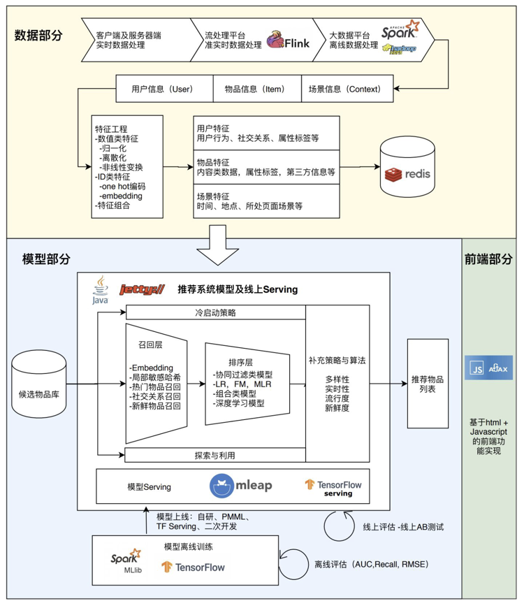
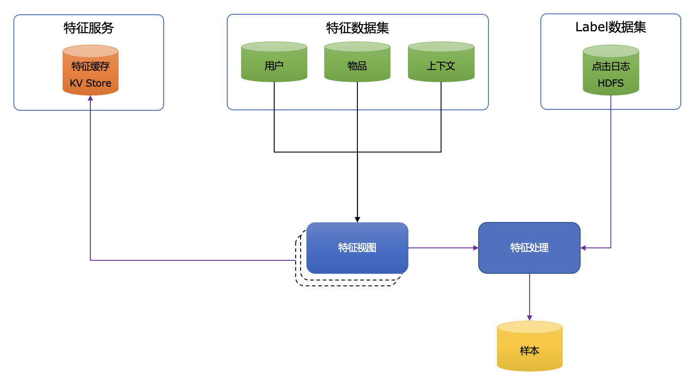
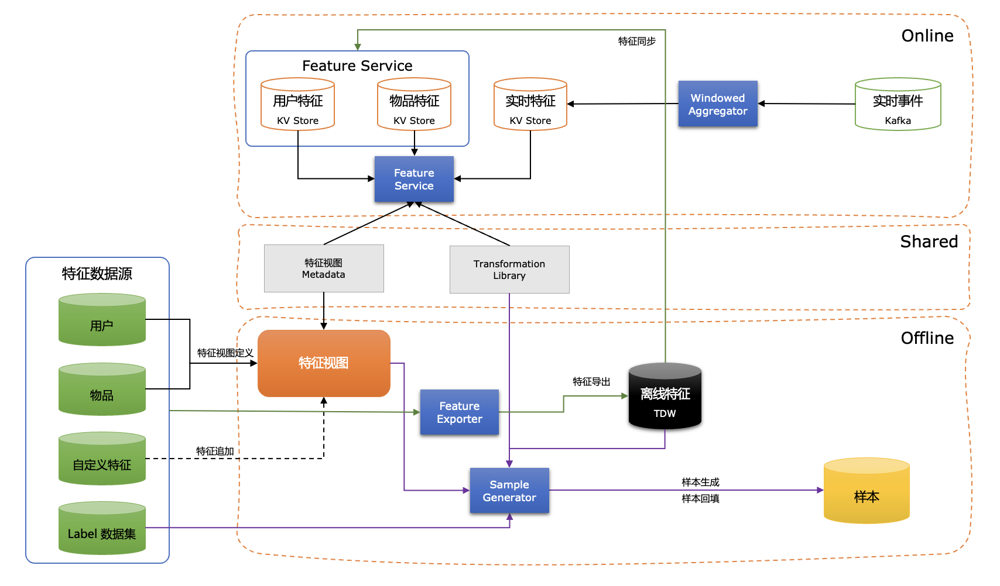
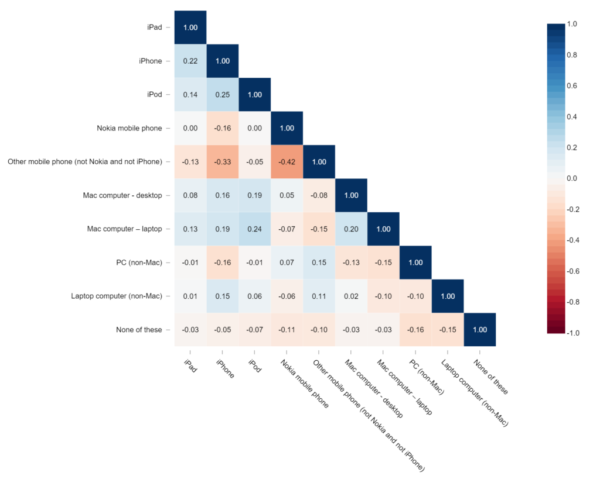

# 推荐特征引擎 - Feature Store

### 推荐系统的复杂性

> 参考架构图来源：[我的实战课程「深度学习推荐系统实战」-王喆的机器学习笔记](https://zhuanlan.zhihu.com/p/341895115)

这是一个典型的推荐系统架构，完成一个推荐模型的训练发布上线以及完成在线推荐请求的处理涉及到很多系统的对接、不同特点技术栈的组织以及数据工程师、算法工程师、系统工程师的协作。在每个系统没有明显的短板且工程师们之间的配合良好的情况下才有可能让模型正确地、高效地服务线上的业务。

    

归纳来讲推荐系统中核心的问题是：**工程师技能差异问题**，**数据复杂且链路长的问题**，**协作的问题**。

#### 工程师技能差异问题

- 推荐系统横跨数据处理、算法建模和高性能工程三种类型差异很大的工作；
- 技术专业度很强，尤其工程背景的同学对理解算法建模领域知识、相关技术有较大困难；

#### 数据复杂且链路长的问题

- 训练：用户标签+物品标签 -> Sparse样本 -> 网络 -> 模型；

- 预测：用户ID -> 用户特征 -> 召回物品列表 -> 物品特征 -> 物品排序；

数据转换环节很多，表示形式多样，在训练阶段需要将原始用户画像、物品标签经过Onehot编码、归一化处理、特征交叉处理后生成Sparse表示的样本，算法工程师将样本输入到网络后训练出CTR模型；在线接受到对用户和候选集的排序请求后需要按照对应的用户/物品ID查找出对应的原始特征表示，再将原始特征按照训练时（离线）完全一致的处理进行编码和归一化处理后才能输入模型做排序计算。

在这个过程中保证线上、线下数据的一致性是一个核心需要保证的点，一旦特征的编码或者处理方法不一致时，模型就可能会得到一个不准确甚至错误的结果。举例来讲，我们有phone_model和dgree两个特征，由于Huawei Mate 50型号的手机最新上市，在训练样本中没有出现过这个特征值，但是线上预测的逻辑会将新的手机型号进行编码，这样导致`1500`之后的所有特征就会跟模型中的产生错位，模型就没法基于错误的数据作出正确的预测。

**训练阶段**

| Feature     | Value              | Encoding |
| ----------- | ------------------ | -------- |
| phone_model | iPhone-13          | 1000     |
| phone_model | ... ...            | ... ...  |
| phone_model | Huawei Mate 40 Pro | 1500     |
| dgree       | 小学               | 1501     |
| dgree       | ... ...            | ... ...  |
| dgree       | 博士               | 1509     |
| dgree       | Unkown             | 1510     |

**预测阶段**

| Feature     | Value              | Encoding |
| ----------- | ------------------ | -------- |
| phone_model | iPhone-13          | 1000     |
| phone_model | ... ...            | ... ...  |
| phone_model | Huawei Mate 40 Pro | 1500     |
| phone_model | **Huawei Mate 50** | **1501** |
| dgree       | 小学               | 1502     |
| dgree       | ... ...            | ... ...  |
| dgree       | 博士               | 1510     |
| dgree       | Unkown             | 1511     |

#### 协作的问题

> TODO

### Feature Store

Feature Store做为推荐系统的重要组成部分，对解决数据复杂性问题和协作问题至关重要。那我们该如何理解Feature Store呢？[featurestore.org](https://www.featurestore.org/what-is-a-feature-store)的定义是：

> The Feature Store is where the features are stored and organized for the explicit purpose of being used to either train models (by Data Scientists) or make [predictions](https://www.datarobot.com/wiki/prediction/#:~:text=What does Prediction mean in,will churn in 30 days.) (by applications that have a trained model).

Feature Store通常包含以下组成或者能力：

**特征元数据描述**：对用户、物品、上下文等特征的元数据描述，包括特征的类型、数据类型、值的范围、数据来源等；

**灵活的特征处理能力**：针对离散、连续及需要做交叉的特征提供灵活方便的特征处理的组件；

**快速的样本生成能力**：基于算法工程师选择的特征及处理方法能够快速生成训练和验证样本；

**特征分析和评估能力**：在特征探索阶段对离散、连续特征进行分布、Min/Max/Mean/Variance/Std/L1 Norm/L2 Norm等值的分析；针对推荐场景的目标评估不同的特征对模型的贡献值；

**高性能特征KV存储和在线特征查询服务**：满足业务容量的特征KV存储，能够在线通过SDK提供基于用户/物品ID的高性能特征查询服务；

**离线和在线特征的一致**：通过特征元数据和特征处理逻辑等的线下、线上复用和共享满足特征一致性要求；

**特征质量管理机制**：通过对特征分布及统计信息，以及正负样本的比例等数据变化的监控确保上游数据的质量，保证推荐结果的可信；

### 特征分类

对特征的全面理解以及设计一个完善的特征系统需要对特征有个多维度的理解，下面是我对特征分类的一种组织方式：

**从特征描述的对象进行分类**

| 分类       | 描述                                           | 举例                       |
| ---------- | ---------------------------------------------- | -------------------------- |
| 用户特征   | 描述用户的特征                                 | 年龄、性别等               |
| 物品特征   | 描述物品的特征                                 | 物品价格、颜色、型号等     |
| 上下文特征 | 描述发生点击、流量或者发起推荐请求时的环境特征 | 浏览时是否是周末、网络模式 |

**从特征值的特点进行分类**

| 分类               | 描述                                         | 举例                           |
| ------------------ | -------------------------------------------- | ------------------------------ |
| 连续特征           | 数值特征，且数值的大小比较是有意义的         | 近7天浏览的物品时长和数量      |
| 离散特征           | 类型特征，或者数值代表类型且大小比较无意义的 | 年龄段                         |
| 多值离散特征       | 包含多个离散值的特征                         | 最近浏览过的物品所属的类别列表 |
| 带权重多值离散特征 | 包含多个离散值，且每个离散值有一定的权重值   | 用户偏好风格及权重             |
| Embedding特征      | 用一组Embedding值描述的特征                  | 预训练Embedding                |

**从对特征的处理方法进行分类**

| 分类            | 描述                                                | 举例                            |
| --------------- | --------------------------------------------------- | ------------------------------- |
| One-hot编码特征 | 进行One-hot编码后的特征，只针对离散特征             | -                               |
| 标准化特征      | 进行归一化、标准化后的特征，只针对连续特征          | -                               |
| 交叉特征        | 原用户、物品特征通过product或者距离计算后得到的特征 | 物品tag和用户tag进行dot product |

**从特征实时度进行分类**

| 分类     | 描述                                     | 举例                                 |
| -------- | ---------------------------------------- | ------------------------------------ |
| 离线特征 | 在线上特征的一个更新周期内不会变化的特征 | 年龄、性别                           |
| 实时特征 | 随请求的时间变化特征值会动态变化的特征   | 上一小时停留时长、最近浏览的10个物品 |

### 概念

#### 数据集

**数据集**表示特征对应对数据源定义及元数据信息，包括离线和在线数据对应对物理存储，数据源描述特征的名称、数据类型、是连续还是离散特征、是实时还是离线特征、聚合方式等信息。它是对于特征数据源的物理描述。

#### Label数据集

**Label数据集**是包含了用户、物品标识、时间戳及上下文信息的的数据，通常是点击、浏览等日志，通过关联用户和物品特征生成样本数据。

#### 特征视图

**特征视图**表示对于一组特征组合等逻辑表示，从**数据集**的所有特征中选取一部分特征子集用于特定模型等特征输入，通过**特征视图**定义可以将特征选择的结果进行统一管理。

#### 特征追加

**特征追加**在需要在已有**特征视图**之上快速增加一组其他特征进行特征分析或建模实验时，可基于已有**特征视图**进行**特征追加**从而产生新的**特征视图**。

通过次方法构建的**特征视图**在生成样本和特征时可以进行数据复用，在降低存储成本的同时提升特征和样本生成效率。

#### 样本

**样本**通过对应对特征集合关联Label数据后生成的包含[Label, Feature-Indices, Feature-Values]的样本数据，用于输入模型进行模型训练。

#### 样本回填(Backfill)

**样本回填**也叫**样本回滚**或者**样本回放**，在已经存在的样本基础上增加特征后生成包含有新特征的样本的过程叫**样本回填**。

### 特征数据流

1. 首先通过**特征注册**将用户、物品、上下文等特征注册到**特征数据集**中，包含了所有可能用到的特征以及特征的名称、数据类型、是连续还是离散特征、是实时还是离线特征、聚合方式等元数据；

2. 针对于某个业务场景或者模型可以从**特征数据集**中选择一部分特征子集作为**特征视图**；

3. 定义**Label数据集**并设置数据集中用于标识的物品和用户字段；
4. 结合#2和#3，定义在此特征视图中对每个特征处理的方法和逻辑，并提交样本生成任务生成训练和测试样本；
5. 从系统全局对所有的特征视图做并集后将所有用到的特征按用户和物品维度同步到线上KV存储中；
6. 在线请求时**特征服务**根据所请求的用户和物品获取用户和物品的特征表示；

### Feature Store架构设计

从全局视图来看Feagine特征引擎架构设计包括离线、在线和共享三部分，具体每部分的职责和特性如下。

**离线**

首先基于全量的用户和物品以及特征视图定义会生成用户、物品的离线特征；此离线特征会同步到线上到高速存储作为在线特征缓存。

另外对于特征视图定义系统将生成对应的元数据；同时用户定义特征处理逻辑也会生成相关元数据。结合离线特征、特征视图定义、特征处理逻辑以及Label数据集就可以通过`Transformation Library`生成离线训练样本，离线生成的样本数据将可以直接用于模型训练。

**在线**

在处理在线请求时，每个请求将同时从用户特征缓存、物品特征缓存以及实时特征中获取特征，再根据当前请求对应到特征视图和特征处理元数据进行对应特征组织和转换。实时特征到生成将会由`Windowed Aggregator`在流式数据上进行窗口聚合处理后存入高速缓存。

**共享**

在线上和线下处理过程中特征视图和特征处理元数据，以及特征处理的`Transformation Library`是公用的，以此确保线上线下的处理一致性和降低处理逻辑的复杂度。

#### Feature Exporter

`Feature Exporter`是一个Spark任务，负责将来源于多个存储的特征数据导入到离线特征存储和在线特征缓存中。

#### Sample Generator

`Sample Generator`关联特征视图、Label数据集以及对特征的处理定义生成样本，在特征视图中新增加特征后也可以完成样本回填。

#### Windowed Aggregator

`Windowed Aggregator`提供`MIN/MAX/AVG/COUNT/SUM/LAST_N`等对某个时间窗口对统计算子，将对应的实时特征写入到KV存储中。

#### Feature Service

`Feature Service`以SDK形式提供对用户/物品的特征在线查询和转换服务，按需查询特征视图中用到的用户、物品和实时特征，并按照样本生成时相同的处理逻辑复用`Transformation Library`将特征转换为模型可以直接接收的数据格式。

### 特征KV存储结构

此处选取Redis作为线上特征KV存储，考虑到特征数据本身的特点和在线请求时的特点，用[Reids Hash](https://redis.io/docs/manual/data-types/#hashes)数据类型存储用户和物品特征。

> 具体情况可以参考[Doordash](https://doordash.engineering/2020/11/19/building-a-gigascale-ml-feature-store-with-redis/)对特征存储和类型的选项思路和过程

**Key**

{id}:hash(feature_name)，采用Hash的好处在于同一个用户或物品的特征放在一个节点上存储，另外在查询时可以按需仅查询所需的特征。

### 特征分析

#### 特征统计

采用[MultivariateStatisticalSummary](https://spark.apache.org/docs/latest/api/scala/org/apache/spark/mllib/stat/MultivariateStatisticalSummary.html)或者[Summarizer](https://spark.apache.org/docs/latest/api/scala/org/apache/spark/ml/stat/Summarizer$.html)统计特征的max, min, mean, sum, variance, std, number of nonzeros, total count等统计信息。

#### 特征相关性分析

采用Pearson和Spearman相关性生成特征之间的相关性矩阵。

        

#### 特征分布

**连续值分布**

对于连续特征采用[KDE](https://en.wikipedia.org/wiki/Kernel_density_estimation)(Kernel Density Estimation)方法来评估特征值的分布，当前只支持Gaussian Kernal。

**离散值分布**

对于离散特征，统计各个类别中样本的数量分布。

#### 特征重要性评估

采用XGboost评估特征对目标的显著性贡献，可从[Weight/Gain/Cover](https://towardsdatascience.com/be-careful-when-interpreting-your-features-importance-in-xgboost-6e16132588e7)三种不同Metrics进行重要性分析。

### 特征监控

#### 样本监控

特征监控主要面向周期生成样本进行训练的场景，通过监控：

1. 样本量
2. 样本中的正负样本比例

确保训练样本的规模和比例稳定。

#### 特征监控

**连续特征**

对于连续特征按周期统计max, min, mean, sum, variance, std, number of nonzeros, total count等统计信息，并基于合适的波动范围建立监控。

**离散特征**

对于离散特征，监控每个独立离散值的数据量和所占比例。
